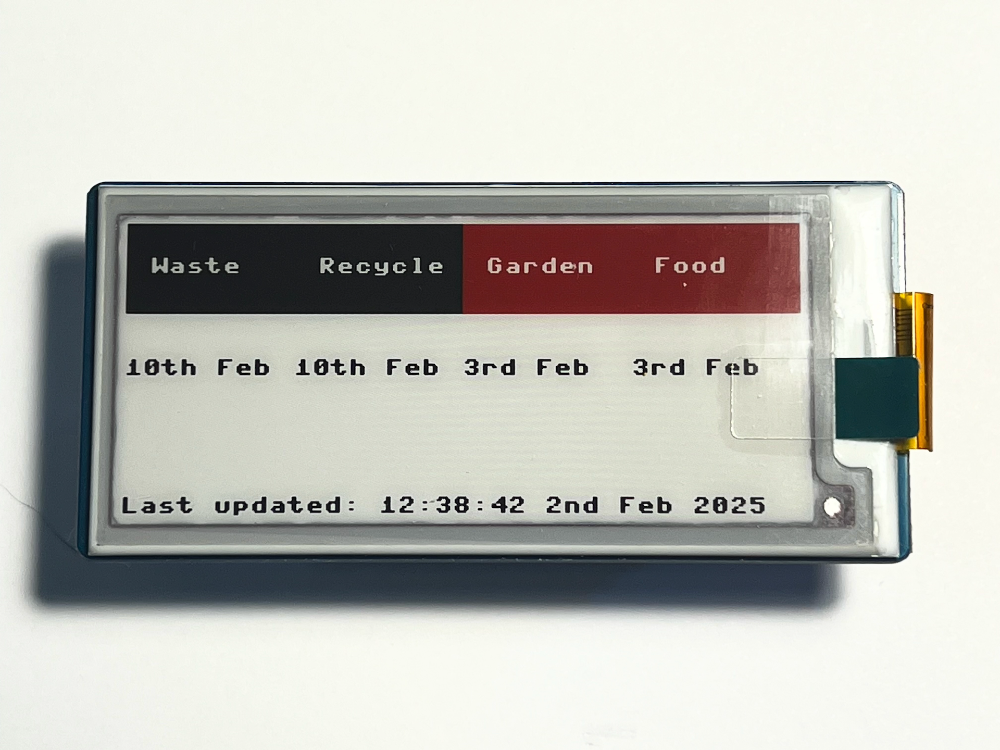
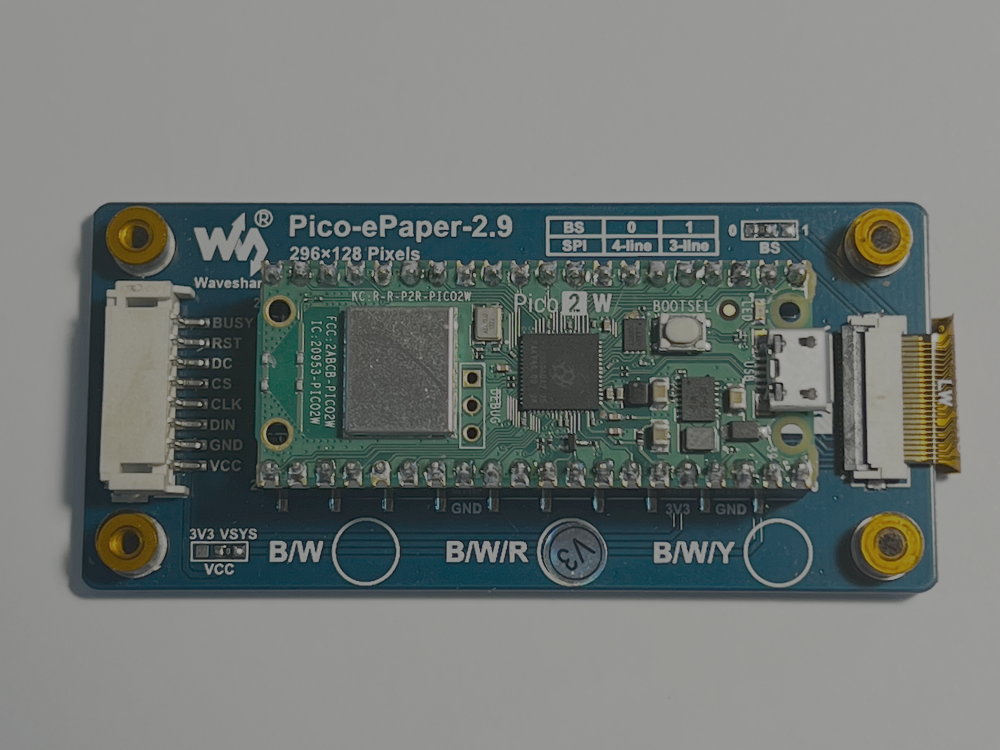

# pico-bins
Display a schedule for which bins need putting out using a Raspberry Pi Pico 2 W and a Waveshare e-ink display. This code was written for the Waveshare 2.9" B/W/R display, but it should be straightforward to adapt to other displays.

The bins that are due to be put out on the next collection day are highlighted in red.





This code requires access to WiFi in order to set the system clock to the correct time. To configure the connection, copy `config_sample.py` to `config.py` and add your WIFI connection details:

```
# Edit the following lines and rename this file to config.py
WIFI_SSID="<Put your SSID here>"
WIFI_PASSWORD="<Put your WiFi password here>"
```

The code was written for my local bin schedule, but should work with any similar repeating schedule. By default, it is set up with the following bins:

- Food bin (emptied weekly)
- Recycling bin (emptied every two weeks)
- Garden waste (emptied every two weeks)
- General waste (emptied every three weeks)

To change this schedule, edit `bin.py` where the bins are defined:

```
bins = [
    Bin(BIN_WASTE, _to_time(2025, 1, 20), 21),
    Bin(BIN_RECYCLING, _to_time(2025, 1, 13), 14),
    Bin(BIN_GARDEN, _to_time(2025, 1, 6), 14),
    Bin(BIN_FOOD, _to_time(2025, 1, 6), 7)
]
```
The date should be the most recent date that the bin was emptied, and the final parameter is the number of days between emptying.

This is a work-in-progress and still under development.

